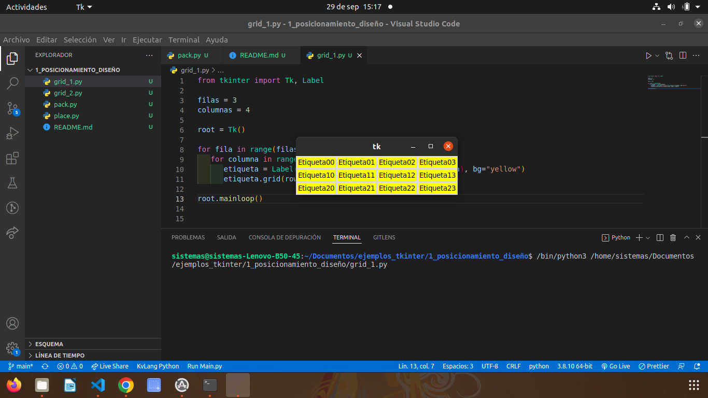
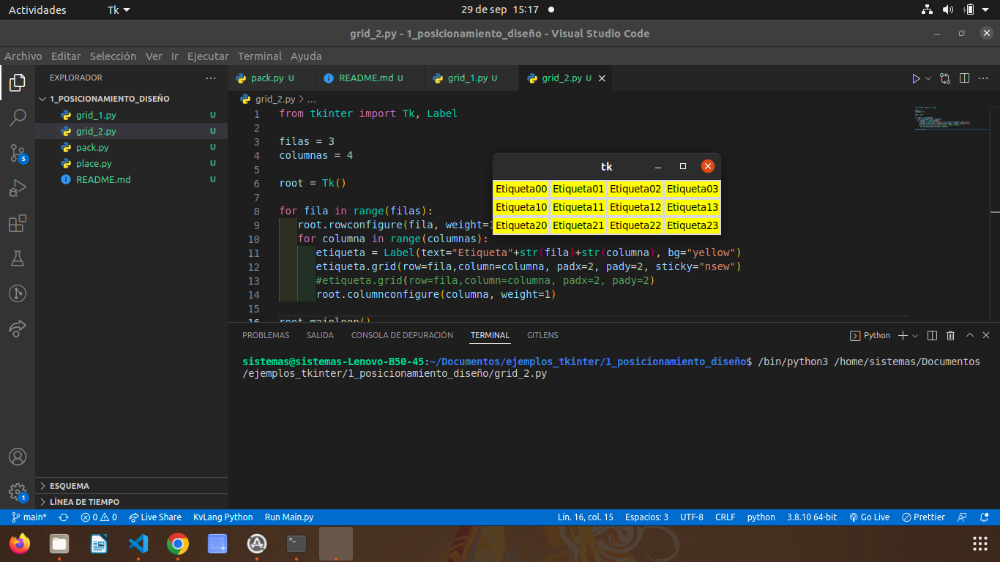
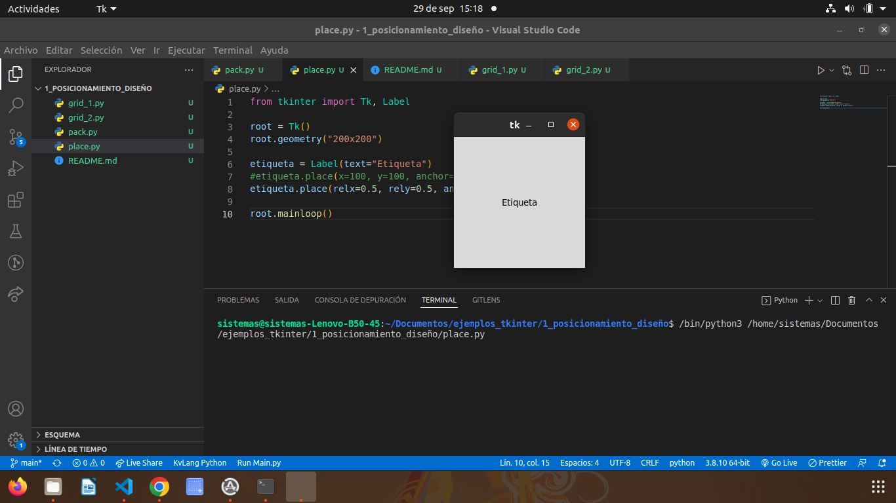

# 1. POSICIONAMIENTO Y DISEÑO

## Gestor de geometría pack

### este gestor de geometría distribuye los widgets en horizontal y vertical.

## Gestor de geometría Grid

### Con grid la distribución de los widgets se realiza de una manera más flexible, utilizando un diseño de cuadrícula. De esta manera , cada widget en la celda determinada por la interseccion de una fila y una columna.

# Gestor de geometría place

### Este gestor permite colocar los widgets en coordenadas especificas de la ventana principal o de la widget contenedor

