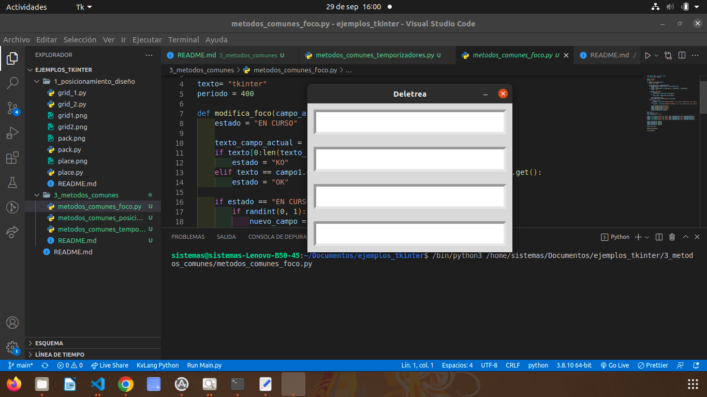
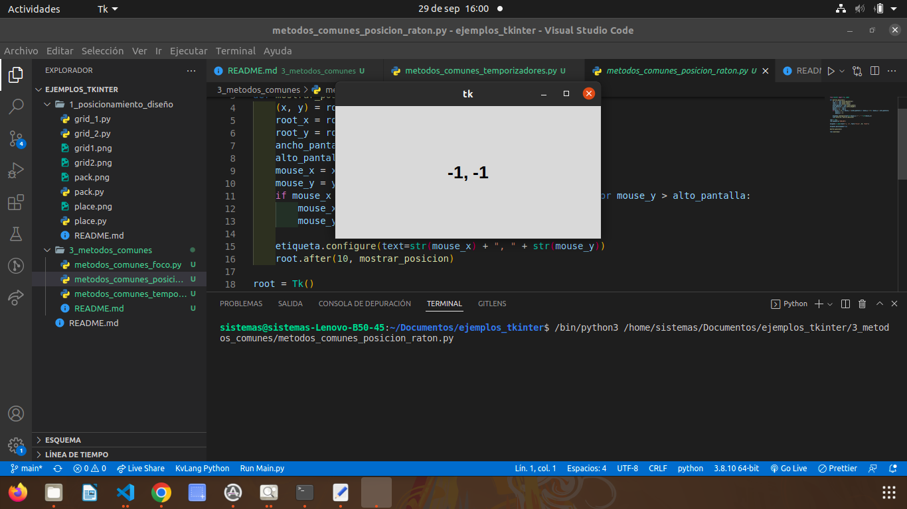
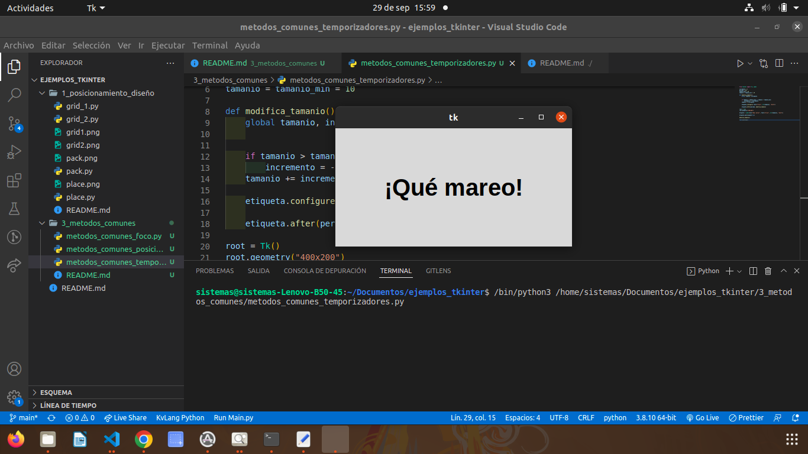

# 2. METODOS_COMUNES

## metodo comun foco

### este metodo permite poner letras en diferentes label para uso didactico

## metodo comun posicion

### Funciona por medio del mouse dependiendo que tanto lo muevas se iran moviendo los numeros de la pantalla, simplemente con base en la posicion del mouse

# Gestor de geometría place

### Este gestor permite colocar los widgets en coordenadas especificas de la ventana principal o de la widget contenedor

