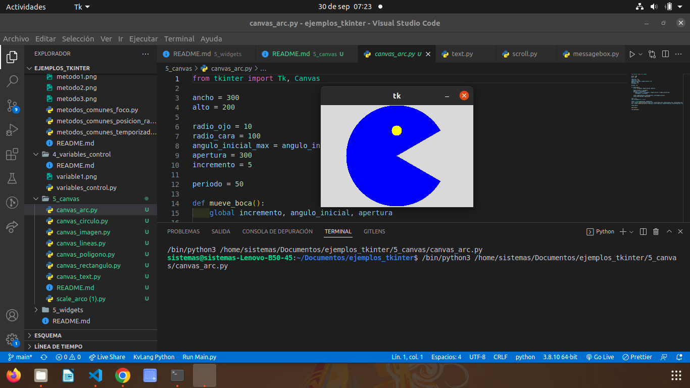
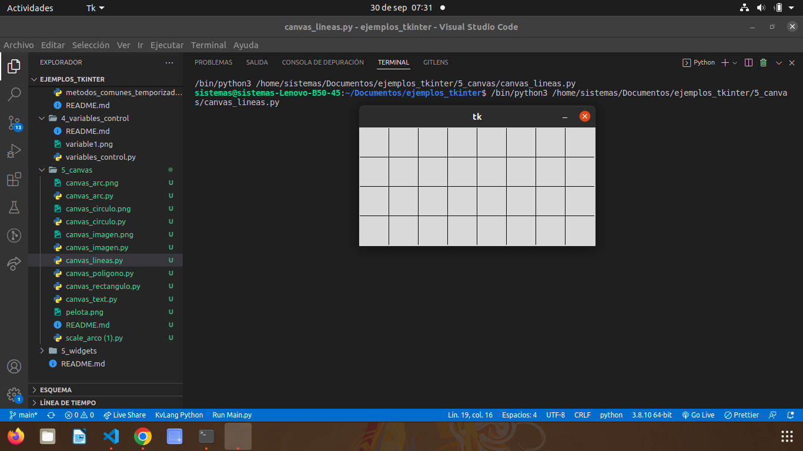
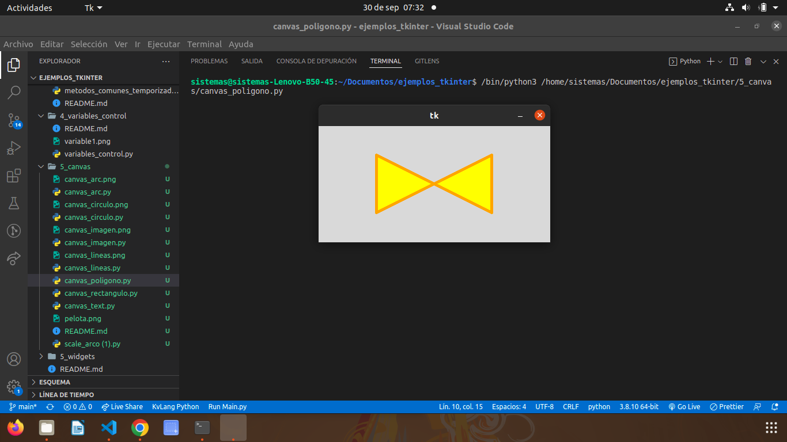
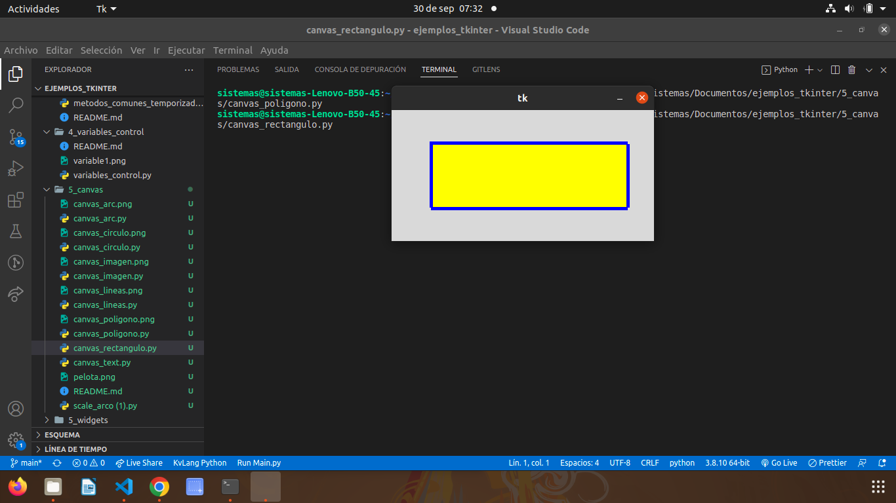
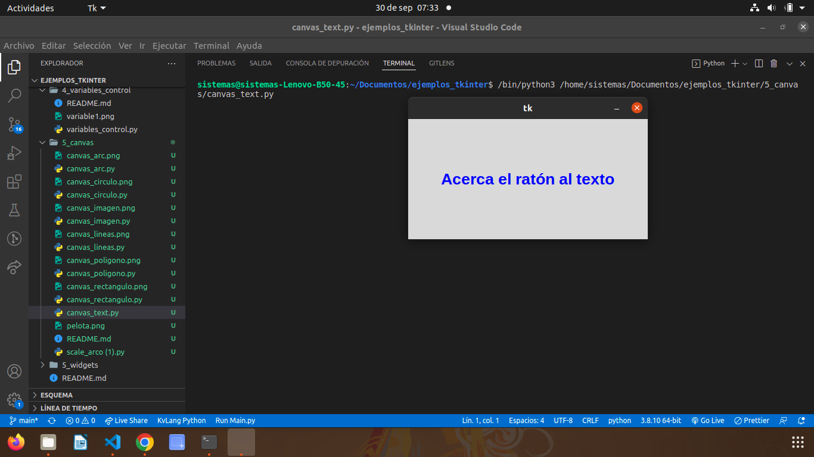
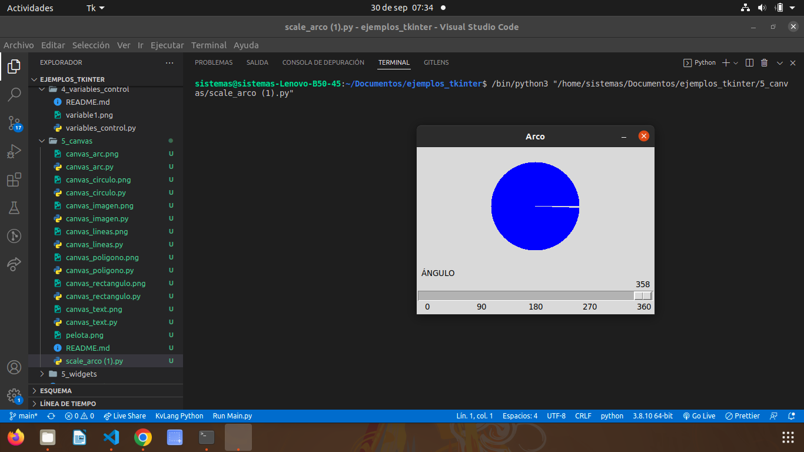

# CANVAS

## CANVAS ARC

### esta canva se utuliza con el angulo inicial y forma un pacman

## CANVAS CIRCULO

### esta canva hace el desplazamiento de una pelota

## CANVAS IMAGEN

### esta canva mueve la imagen que usted quiera poner de balon con el aungulo x y y

## CANVAS POLIGONO

### Esta canva con triangulos forma figuras

## CANVAS RECTAGUNLO

### esta canva mueve la figura que es un rectrangulo

## CANVAS TEXT

### esta canva nos dice que arrastremos el raton al texto

## SCALE ARCO

### Este widget nos permite arrastrar el angulo y se va formando el circulo

