# WIDGETS

## BUTTON

### este widget nos ayuda a contabilizar el tiempo donde aparecen los segundos.

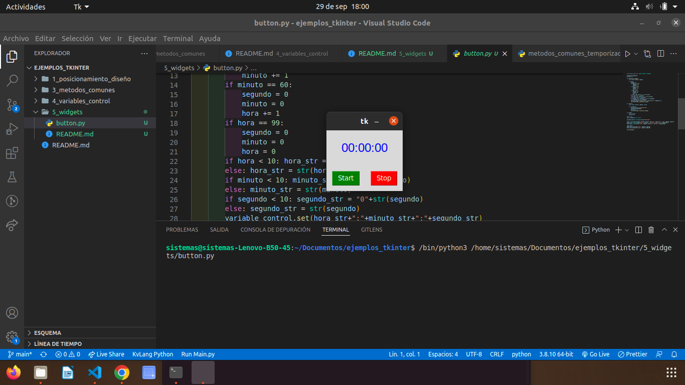

## LABEL RELOJ

### Este widget actualiza la hora en horas, minutos y segundos

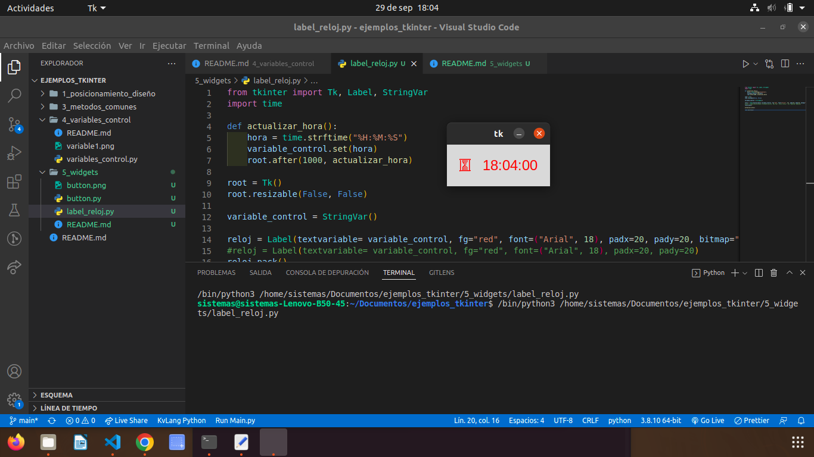

# MENU

### Este Widget me da una serie de opciones y me sale el boton de salir y deshacer.

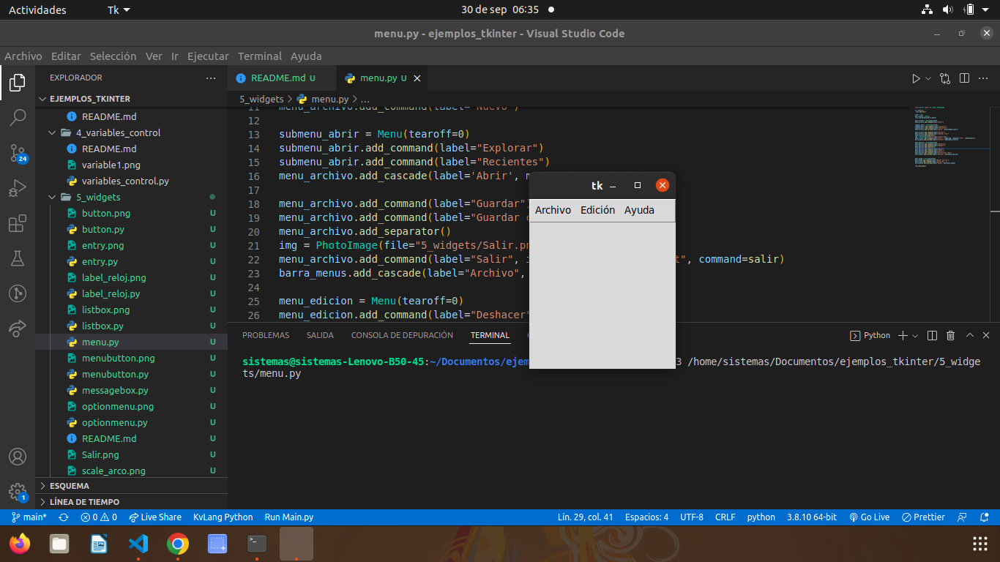

## MESSAGE BOX

### Este widget es parecido a word y es version 1.0.

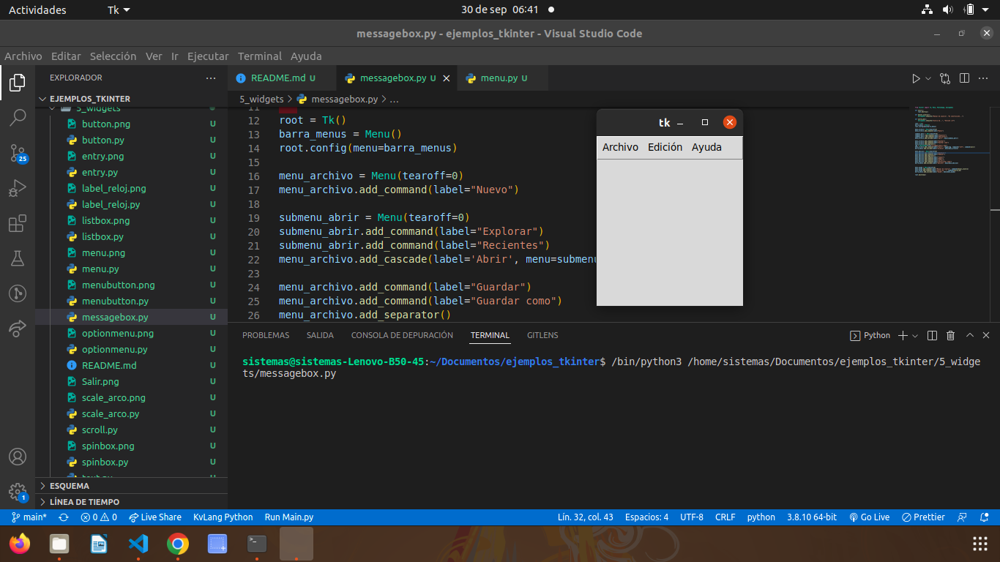

## SCALE ARCO

### Este widget sirve para ir moviendo el angulo y el le va formando el circulo en la pantalla

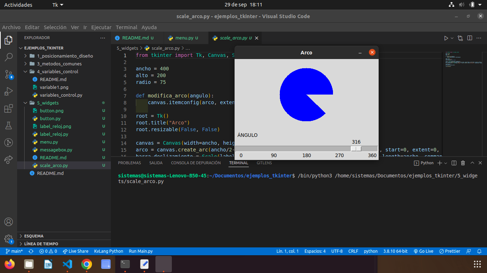

## SPINBOX

### Este widget le da un Formulario donde aparece para escribir su nombre, dirección y edad

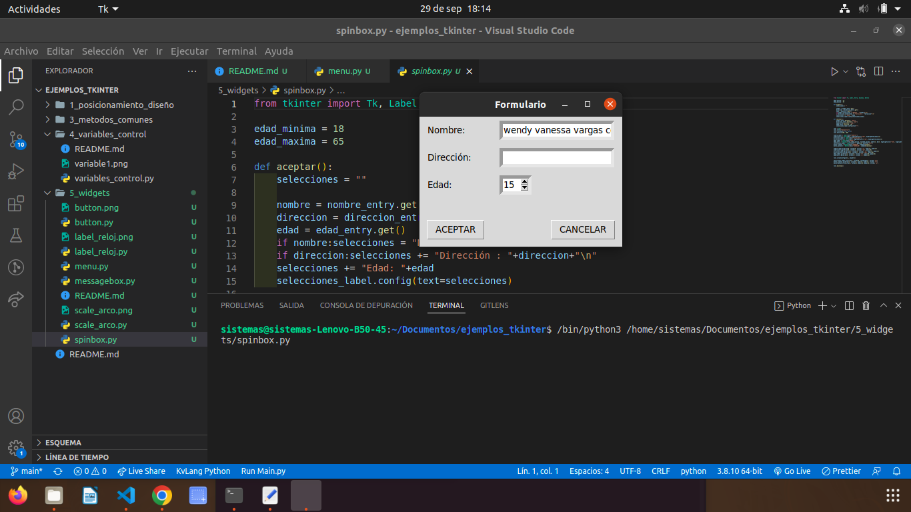

## TOPLEVEL

### Este widget te da una ventana de accesos donde te tienes que registrar con tu usuario y contraseña

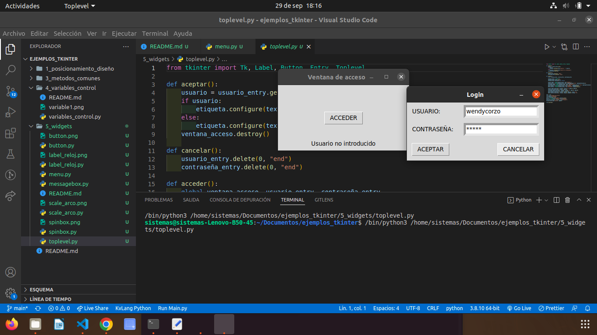

## ENTRY

### Este widget de una te da ingreso para que pongas tu usuario y contraseña

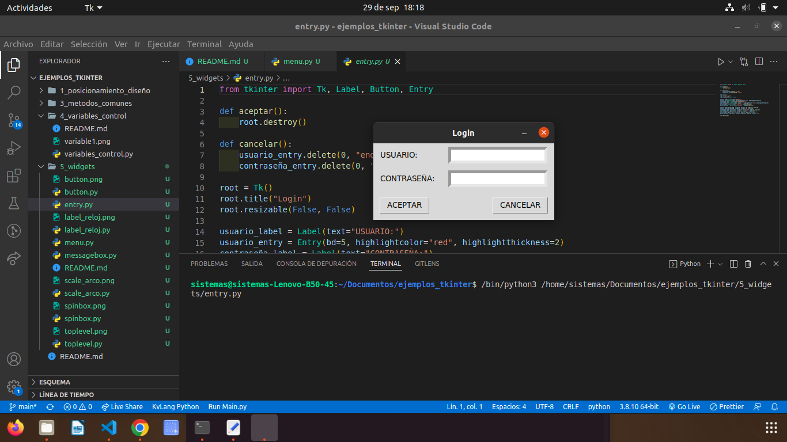

## LISTBOX

### Este widget te da la opcion del idioma en que quieras el Hola

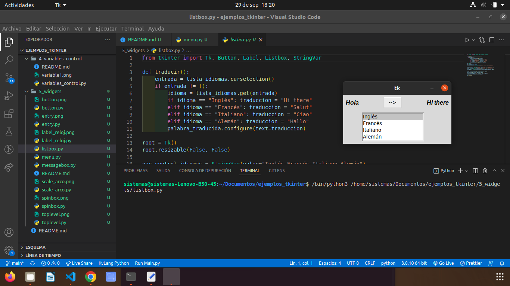

## MENU BUTTON

### Este widget te da un formulario mas completo es decir le agrega el sexo y la provincia

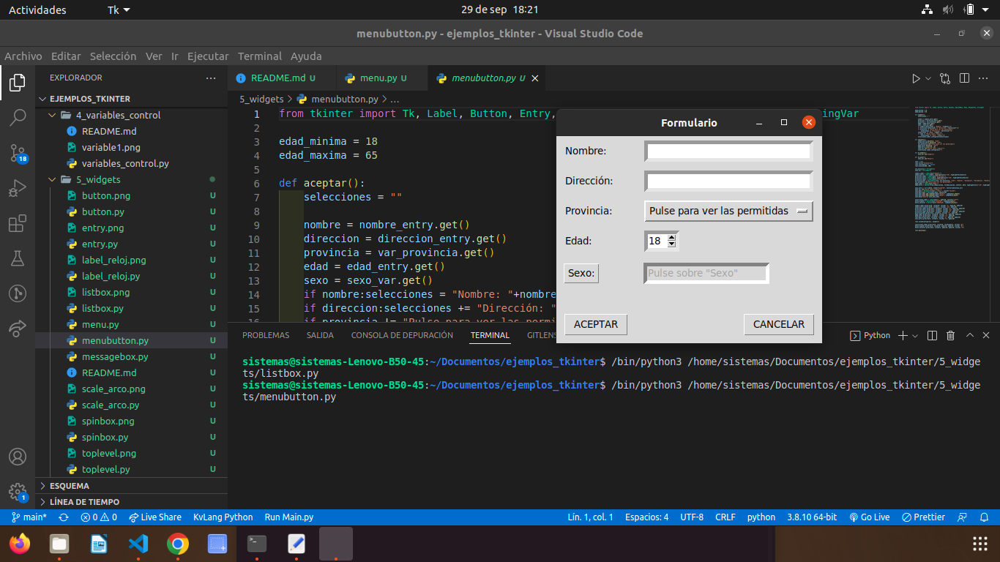

## OPTION MENU

### este widget te da un formulario

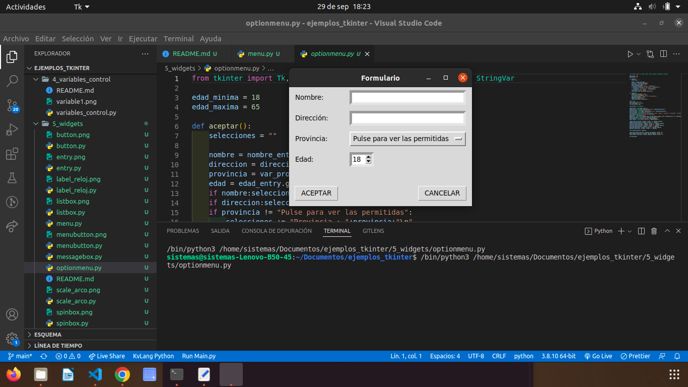

## SCROLL

### este widget es un editor de texto

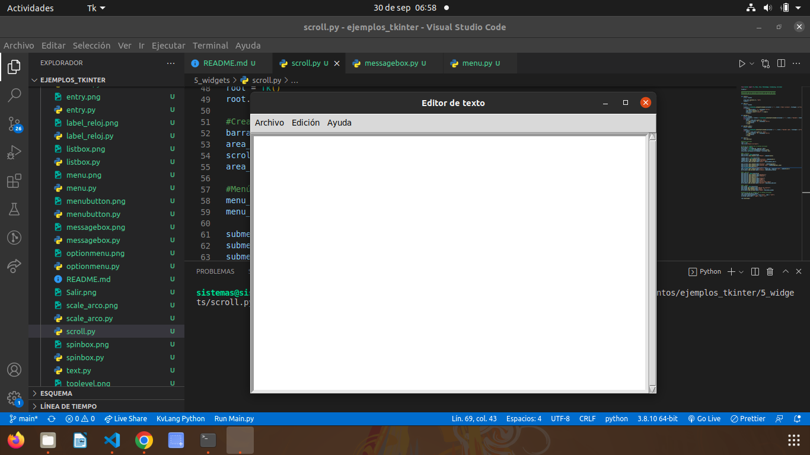

## TEXT

### este widget es un editor de texto

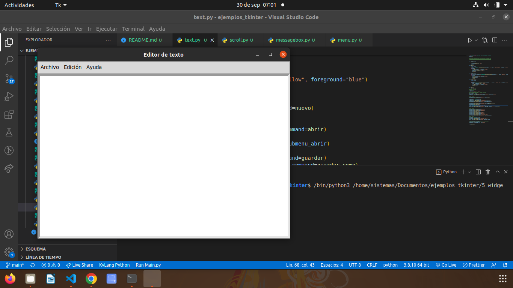
